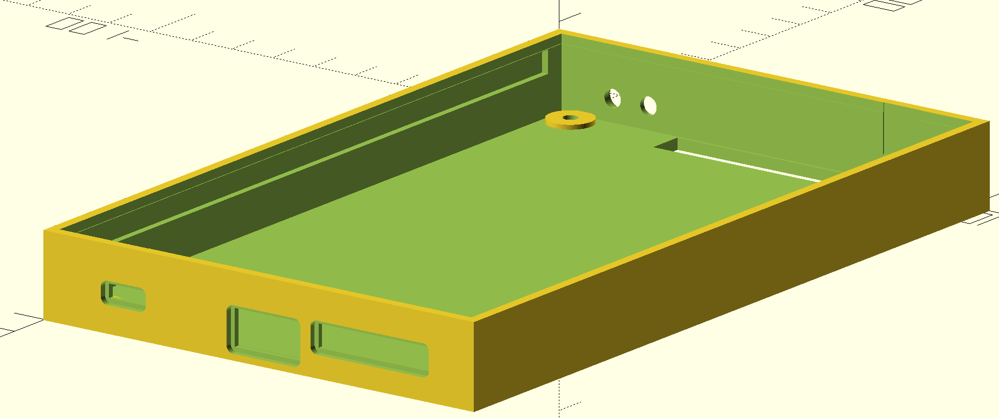
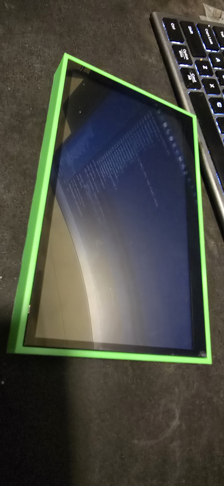
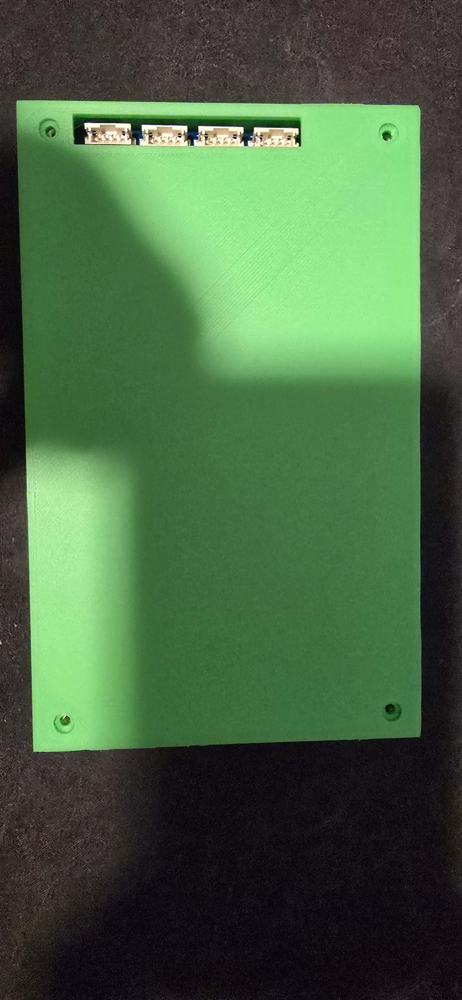
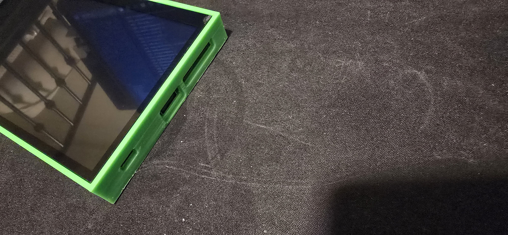
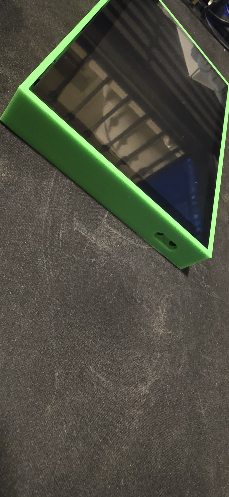

# ESP32-P4-WIFI6-Touch-LCD-7B Enclosure

Custom OpenSCAD enclosure designed for the  
WaveShare ESP32-P4-WIFI6-Touch-LCD-7B 7" touchscreen development board.

---

## Features

- Parametric OpenSCAD enclosure
- Designed for the 7" glass touchscreen
- Industrial enclosure styling
- Customizable dimensions
- Ventilation support
- Easy to modify
- FDM 3D printer friendly

---

## To Download go here to Support Development

- [Buy Me a Coffee](https://buymeacoffee.com/shafiq9018) <---- To Download Go Here
- [PayPal](https://paypal.me/shafiq9018)

## Preview

---

## Hardware Compatibility

Designed for:

- ESP32-P4-WIFI6-Touch-LCD-7B
- ESP32-P4
- ESP32-C6
- 7" capacitive touchscreen display

---

## Adjustable Parameters

- Wall thickness
- Enclosure depth
- Screen clearance
- Vent openings
- Mount spacing
- Corner radius

---

## Included Files

- OpenSCAD source file
- STL preview renders
- Example enclosure configuration

---

## Purchase / Download

[Buy Full Download](https://buymeacoffee.com/shafiq9018)

---

## Support Development

- [Buy Me a Coffee](https://buymeacoffee.com/shafiq9018)
- [PayPal](https://paypal.me/shafiq9018)

---

## Author

Shafiq Rahman
Philadelphia, PA
